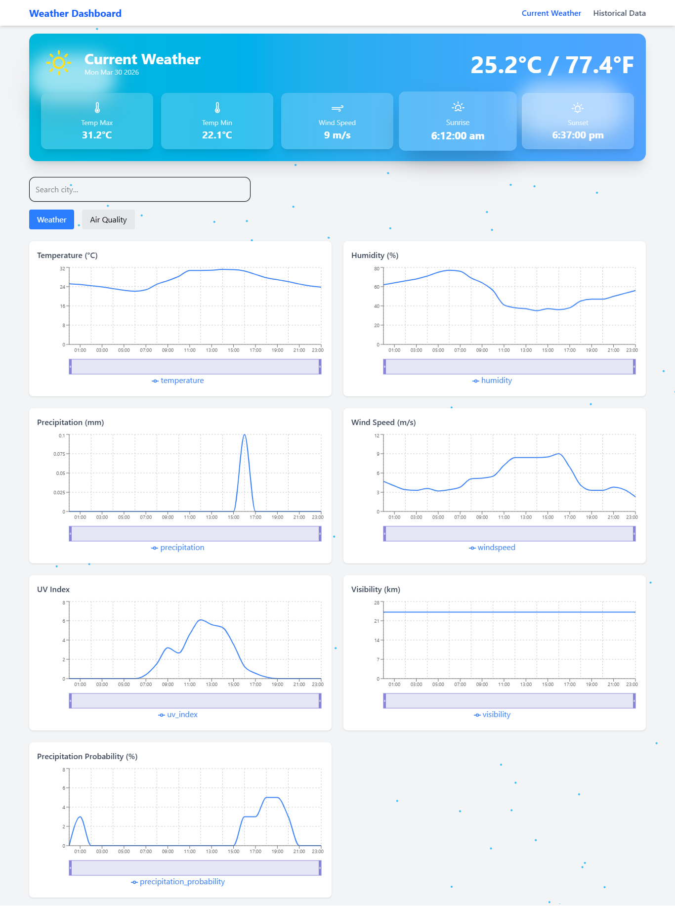
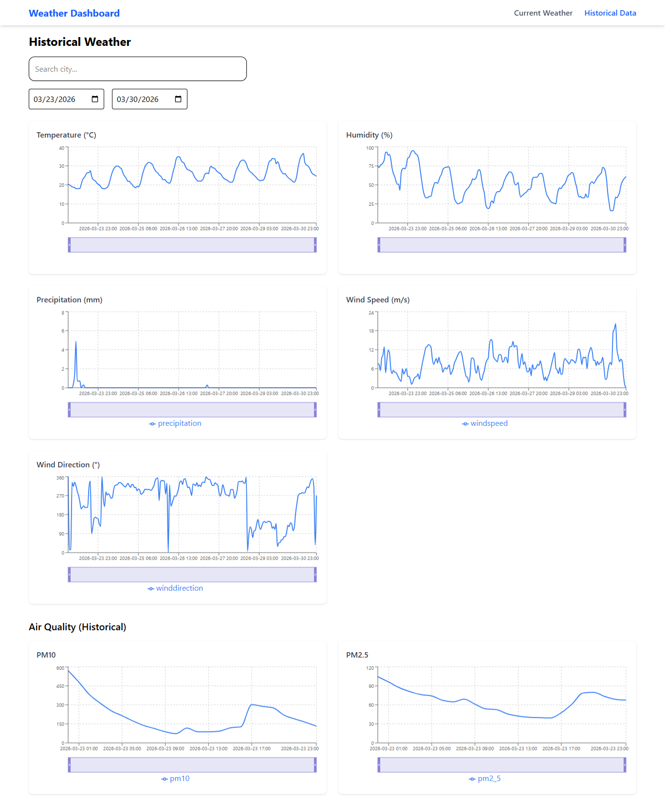
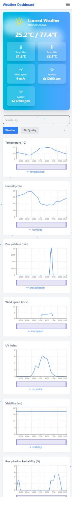
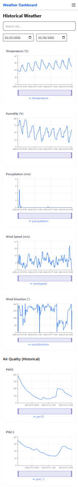

 Weather Dashboard (ReactJS)
#  Weather Dashboard

A responsive and high-performance Weather Dashboard built using **ReactJS** and the **Open-Meteo API**.  
It provides real-time weather data, air quality insights, and historical trends with interactive charts.

---

##  Features

###  Current Weather (Page 1)
- Auto-detects user location using browser GPS
- Displays:
  - Temperature (Min, Max, Current)
  - Precipitation
  - Sunrise & Sunset
  - Wind Speed
  - Humidity
  - UV Index
  - Visibility
  - Precipitation Probability
- Air Quality:
  - PM10
  - PM2.5
  - CO, NO2, SO2
- City Search support
- Dynamic UI with weather-based gradients

---

###  Hourly Graphs
- Individual graphs for:
  - Temperature
  - Humidity
  - Precipitation
  - Wind Speed
  - Visibility
  - PM10 & PM2.5
- Features:
  - Horizontal scrolling
  - Zoom (Brush control)
  - Responsive charts

---

###  Historical Weather (Page 2)
- Select custom date range (max 2 years)
- Displays:
  - Temperature trends
  - Humidity
  - Precipitation
  - Wind Speed & Direction
  - Air Quality (PM10, PM2.5)
- Interactive charts for all parameters

---

### Performance Optimizations
- LocalStorage caching (10-minute expiry)
- useMemo for heavy computations
- Reduced API calls
- Fast rendering (~500ms target)

---

###  Responsive Design
- Fully mobile-friendly
- Adaptive layouts for all screen sizes
- Mobile navigation menu

---

###  Navigation
- Multi-page routing using React Router
- Sticky responsive header
- Active page highlighting

---

###  404 Page
- Custom Not Found page for invalid routes

---

##  Tech Stack

- ReactJS
- Tailwind CSS
- Recharts (for graphs)
- React Router DOM
- Axios
- Open-Meteo API


---

##  Installation & Setup

```bash
# Clone repository
git clone https://github.com/PriyanjalDurgapal/weather-dashboard-react.git

# Navigate to project
cd weather-dashboard

# Install dependencies
npm install

# Run development server
npm run dev
 API Used
Open-Meteo Weather API
Open-Meteo Air Quality API
Open-Meteo Geocoding API

 Key Highlights
Real-time + historical weather in one app
Smart caching system for performance
Interactive charts with zoom & scroll
Clean and modular React architecture
Production-ready UI/UX

 Learnings
Handling API data efficiently
Optimizing React performance
Building reusable components
Managing state and side effects
Creating responsive and scalable UI

 Screenshots
 
 

 
 